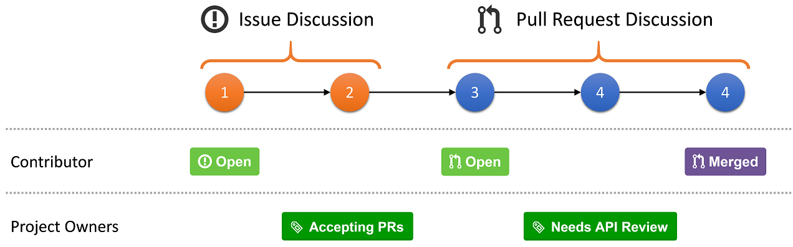

API Review Process
==================

The .NET Framework has a long standing history of taking API usability extremely seriously. Thus, we generally review every single API that is added to the product. This page discusses how we conduct API reviews for components that are open sourced.

## Process Goals

The key goals are:

* **Designed for GitHub**. In order to be sustainable and not be a hurdle for contributors the API review process must feel natural to folks familiar with GitHub.

* **Efficiency**. Performing API reviews requires looping in a set of experts. We want to conduct API reviews in an agile fashion without randomizing the reviewers or community members.

* **Transparency**. We can use the same process for both internal as well as external contributors. This allows contributors to benefit from the results of API reviews even if the implementer isn't external.

## Overall Process

GitHub is generally based around the pull-request model. The idea is that contributors perform their changes in their own fork and submit a pull request against our repository.

For trivial code changes, such as typo fixes, we want folks to directly submit a pull request rather than opening an issue. However, for bug fixes or feature work, we want contributors to first start a discussion by creating an issue.

For work that involves adding new APIs we'd like the issue to contain what we call a *speclet*. The speclet should provide a rough sketch of how the APIs are intended to be used, with sample code that shows typical scenarios. The goal isn't to be complete but rather to illustrate the direction so that readers can judge whether the proposal is sound. Here is [a good example](https://github.com/dotnet/corefx/issues/271).

## Steps

* **Contributor opens an issue**. The issue description should contain a speclet that represents a sketch of the new APIs, including samples on how the APIs are being used. The goal isn't to get a complete API list, but a good handle on how the new APIs would roughly look like and in what scenarios they are being used. Here is [a good example](https://github.com/dotnet/corefx/issues/271).

* **Community discusses the proposal**. If changes are necessary, the contributor is encouraged to edit the issue description. This allows folks joining later to understand the most recent proposal. To avoid confusion, the contributor should maintain a tiny change log, like a bolded "Updates:" followed by a bullet point list of the updates that were being made.

* **Issue is tagged as "Accepting PRs"**. Once the contributor and project owner agree on the overall shape and direction, the project owner tags the issue as "Accepting PRs". The contributor should indicate whether they will be providing the PR or only contributed the idea.

* **Coding**. The contributor is implementing the APIs as discussed. Minor deviations are OK, but if during the implementation the design starts to take a major shift, the contributor is encouraged to go back to the issue and raise the concerns with the current proposal.

* **Pull request is being created**. Once the contributor believes the implementation is ready for review, she creates a pull request, referencing the issue created in the first step. In order to call dips, you can also create the PR before it's completely ready. Use checkboxes to indicate which areas are still missing so that we know it's not ready for review yet. [Here is a good example](https://github.com/dotnet/corefx/pull/316). At this time, if any new API are being added to a type that has shipped in the full .NET Framework, submit the pull request to the *future* branch. See [Branching Guide](branching-guide.md).

* **Pull request is being reviewed**. The community reviews the code for the pull request. The review should focus on the code changes and architecture - not the APIs themselves. Once at least two project owners give their OK, the PR is considered good to go.

* **Pull is tagged as "Needs API Review"**. The project owner then marks the pull request as "Needs API Review".

* **API review**. Using the information in the pull request we'll create an APIX file that constitutes the API delta. The API review board meets multiple times a week to review all PRs that are tagged as needing an API review.

* **API review notes are being published**. After the review, we'll publish the notes in the [API Review repository](https://github.com/dotnet/apireviews). A good example is the [review of immutable collections](https://github.com/dotnet/apireviews/tree/master/2015-01-07-immutable).

* **Pull request is updated with the results of the API Review**. Once the API review is complete, the project owner uploads the notes and API HTML diff, including all comments. The project owner also updates the PR accordingly, with either a call to action to address some concerns or a good to go indicator.

* **Pull request is merged**. When there are no issues - or the issues were addressed by the contributor, the PR is merged.

## API Design Guidelines

The .NET design guidelines are captured in the famous book [Framework Design Guidelines](http://amazon.com/dp/0321545613) by Krzysztof Cwalina and Brad Abrams.

A digest with the most important guidelines are available in our [developer wiki](Framework-Design-Guidelines-Digest). Long term, we'd like to publish the individual guidelines in standalone repo on which we can also accept PRs and -- more importantly for API reviews -- link to.

## API Review Notes

The API review notes are being published in [API Review repository](https://github.com/dotnet/apireviews).
