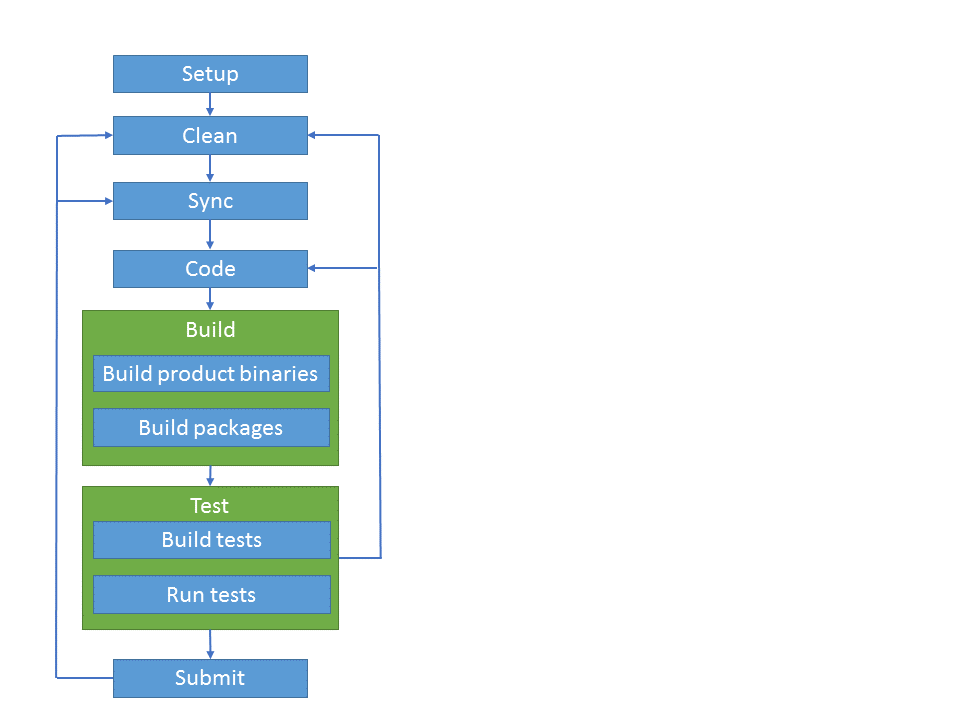

Dev Workflow
===============

The dev workflow describes the development process to follow when working in our repo. 
It is divided into specific tasks that are fast, transparent and easy to understand.

This provides flexibility as with discrete tasks people can iterate on a specific one without needing to run the full workflow, other processes can reuse the tasks as needed and anyone can put together the tasks as wanted to create a customized workflow.

## Process 

All the tasks (except enlist, code, submit) will have scripts located at the root of the repo, and will have usage help to better understand what they provide.
In addition, we want to have an “easy button” script for running many or all of these tasks sequentially in a single command.

## Tasks

**Clean**

Cleans the local enlistment/environment, for example removing files not in the repository. 

**Sync**

The sync task gets the latest source history and packages in order to eliminate all the network traffic when we build. This way we are able to hit the network only when we are intentional about doing it and then be able to build even in offline mode. 
It is important to note that Sync gets the source history by doing `git fetch --all -p –v`.

It does not update branches or merge in changes to local files, giving devs flexibility in managing their Git repos. Devs will need to manually update their local files before restoring packages.

**Build product binaries**

Builds the product binaries without need of hitting the network to restore packages.

**Build packages**

Builds the NuGet packages that are produced from the binaries that were built in the Build product binaries Step.

**Build test binaries, Run test binaries**

Builds and runs the tests that are in the repository and in the near future queue work tests in Helix.

## Current State

Find in the root of the enlistment the following scripts:
* clean.cmd/sh
* sync.cmd/sh
* build.cmd/sh => The dev workflow is not ON (or by default) right now. To give it a try and build without restoring the packages use `/p:RestoreDuringBuild=false`