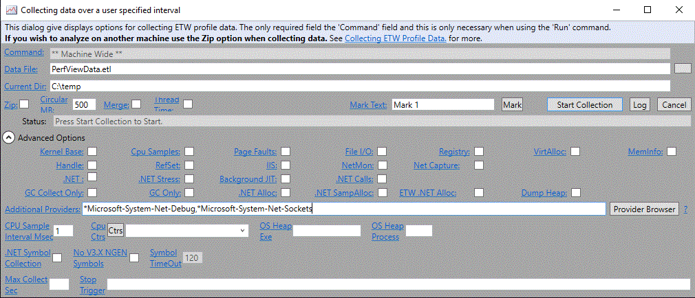

Debugging CoreFX on Windows
==========================

You can Debug .NET Core via Visual Studio or WinDBG.

For Visual Studio debugging, follow the instructions at [Debugging tests in Visual Studio](https://github.com/dotnet/corefx/blob/master/Documentation/building/windows-instructions.md) to run and debug tests.
For bugs that cannot be reproduced within Visual Studio (certain low-probability race conditions, SafeHandle life-time problems, etc) you will need to use WinDBG.

## Required Software

WinDBG free download:

* [WDK and WinDBG downloads](https://msdn.microsoft.com/en-us/windows/hardware/hh852365.aspx)

Note: You can select the Standalone Debugging Tools for Windows or download only WinDBG via the WDK.

## Prerequisites to Debugging with WinDBG

1. Build the entire repository. This ensures that all packages are downloaded and that you have up-to-date symbols.

2. Install WinDBG as post-mortem debugger
As Administrator:

```
windbg -I
```

You may need to do this for both x64 and x86 versions. 
Any application that crashes should now automatically start a WinDBG session.

## Debugging tests
To run a single test from command line:

* Locate the test binary folder based on the CSPROJ name. 

For example: `src\System.Net.Sockets\tests\Functional\System.Net.Sockets.Tests.csproj` will build and output binaries at  `bin\tests\Windows_NT.AnyCPU.Debug\System.Net.Sockets.Tests\netcoreapp1.0`.
 
* Execute the test

Assuming that your repo is at `C:\corefx`:

```
cd C:\corefx\bin\tests\Windows_NT.AnyCPU.Debug\System.Net.Sockets.Tests\netcoreapp1.0
C:\corefx\bin\tests\Windows_NT.AnyCPU.Debug\System.Net.Sockets.Tests\netcoreapp1.0\CoreRun.exe xunit.console.netcore.exe System.Net.Sockets.Tests.dll -xml testResults.xml -notrait category=nonwindowstests -notrait category=OuterLoop -notrait category=failing
```

* If the test crashes or encounteres a `Debugger.Launch()` method call, WinDBG will automatically start and attach to the `CoreRun.exe` process 

The following commands will properly configure the debugging extension and fix symbol and source-code references:

```
.symfix
.srcfix
.reload
!load C:\corefx\packages\runtime.win7-x64.Microsoft.NETCore.Runtime.CoreCLR\<version>\tools\sos
```

_Important_: Pass in the correct path to your SOS extension discovered during the Prerequisites, step 2.

Documentation on how to use the SOS extension is available on [MSDN](https://msdn.microsoft.com/en-us/library/bb190764\(v=vs.110\).aspx).

For quick reference, type the following in WinDBG:

```
0:000> !sos.help
```

## Traces

In Windows, EventSource generated traces are collected via ETW using either logman or PerfView.

### Using Logman
[Logman](https://technet.microsoft.com/en-us/library/bb490956.aspx) ships with Windows and doesn't need to be downloaded or installed.
Given that the ETW providers are dynamically generated and registered by .Net, you need to use the GUIDs and not the names whenever logman is used.

#### Trace a single provider

The following example shows how to trace Sockets:

```
    logman -start SocketTrace -o %SYSTEMDRIVE%\sockets.etl -p "{e03c0352-f9c9-56ff-0ea7-b94ba8cabc6b}" -ets

    // Repro

    logman -stop SocketTrace -ets
```

Logs are going to be placed in %SYSTEMDRIVE%\sockets.etl.

#### Trace multiple providers

1. Create a file called providers.txt with the following contents:

    ```
    "{e03c0352-f9c9-56ff-0ea7-b94ba8cabc6b}"
    "{066c0e27-a02d-5a98-9a4d-078cc3b1a896}"
    "{bdd9a83e-1929-5482-0d73-2fe5e1c0e16d}"
    ```

2. Create the trace

    ```
    logman create trace SystemNetTrace -o sn.etl -pf providers.txt
    ```

3. Start the trace

    ```
    logman start SystemNetTrace
    ```

4. Repro the issue
5. Stop the trace

    ```
    logman stop SystemNetTrace
    ```

   The trace can be restarted from step 3.

6. Remove the trace profile if it's not going to be reused
    ```
    logman delete SystemNetTrace
    ```

7. The logs are placed in sn.etl.

### Using PerfView

1. Install [PerfView](http://www.microsoft.com/en-us/download/details.aspx?id=28567)
2. Run PerfView as Administrator
3. Press Alt+C to collect events 
4. Disable all other collection parameters
5. Add Additional Providers (see below - Important: keep the "*" wildcard before the names.)



### Built-in EventSource tracing

The following EventSources are built-in to CoreFX. The ones that are not marked as [__TestCode__] can be enabled in production scenarios for log collection. 

#### Global
* `*System.Diagnostics.Eventing.FrameworkEventSource {8E9F5090-2D75-4d03-8A81-E5AFBF85DAF1}`: Global EventSource used by multiple namespaces.

#### System.Collections
* `*System.Collections.Concurrent.ConcurrentCollectionsEventSource {35167F8E-49B2-4b96-AB86-435B59336B5E}`: Provides an event source for tracing Coordination Data Structure collection information.

#### System.Linq
* `*System.Linq.Parallel.PlinqEventSource {159eeeec-4a14-4418-a8fe-faabcd987887}`: Provides an event source for tracing PLINQ information.

#### System.Net namespaces
* `*Microsoft-System-Net-Http {bdd9a83e-1929-5482-0d73-2fe5e1c0e16d}`: HTTP-related traces.
* `*Microsoft-System-Net-Mail {42c8027b-f048-58d2-537d-a4a9d5ee7038}`: SMTP-related traces.
* `*Microsoft-System-Net-NameResolution {5f302add-3825-520e-8fa0-627b206e2e7e}`: DNS-related traces.
* `*Microsoft-System-Net-NetworkInformation {b8e42167-0eb2-5e39-97b5-acaca593d3a2}`: Network configuration-related traces.
* `*Microsoft-System-Net-Ping {a771ec4a-7260-59ce-0475-db257437ed8c}`: Ping-related traces.
* `*Microsoft-System-Net-Primitives {a9f9e4e1-0cf5-5005-b530-3d37959d5e84}`: Traces related to core networking-related types.
* `*Microsoft-System-Net-Requests {3763dc7e-7046-5576-9041-5616e21cc2cf}`: WebRequest-related traces.
* `*Microsoft-System-Net-Sockets {e03c0352-f9c9-56ff-0ea7-b94ba8cabc6b}`: Sockets-related traces.
* `*Microsoft-System-Net-Security {066c0e27-a02d-5a98-9a4d-078cc3b1a896}`: Security-related traces.
* `*Microsoft-System-Net-WebHeaderCollection {fd36452f-9f2b-5850-d212-6c436231e3dc}`: WebHeaderCollection-related traces.
* `*Microsoft-System-Net-WebSockets-Client {71cddde3-cf58-52d5-094f-927828a09337}`: ClientWebSocket-related traces.
* `*Microsoft-System-Net-TestLogging {18579866-5c03-5954-91ff-bdc63681458c}`: [__TestCode__] Test-code tracing (I/O async completions, performance test reporting).

#### System.Threading
* `*System.Threading.SynchronizationEventSource {EC631D38-466B-4290-9306-834971BA0217}`: Provides an event source for tracing Coordination Data Structure synchronization information.
* `*System.Threading.Tasks.TplEventSource {2e5dba47-a3d2-4d16-8ee0-6671ffdcd7b5}`: Provides an event source for tracing TPL information.
* `*System.Threading.Tasks.Parallel.EventSource`: Provides an event source for tracing TPL information.
* `*System.Threading.Tasks.Dataflow.DataflowEventSource {16F53577-E41D-43D4-B47E-C17025BF4025}`: Provides an event source for tracing Dataflow information.

## Notes 
* You can find the test invocation command-line by looking at the logs generated after the `msbuild /t:rebuild,test` within the test folder.
