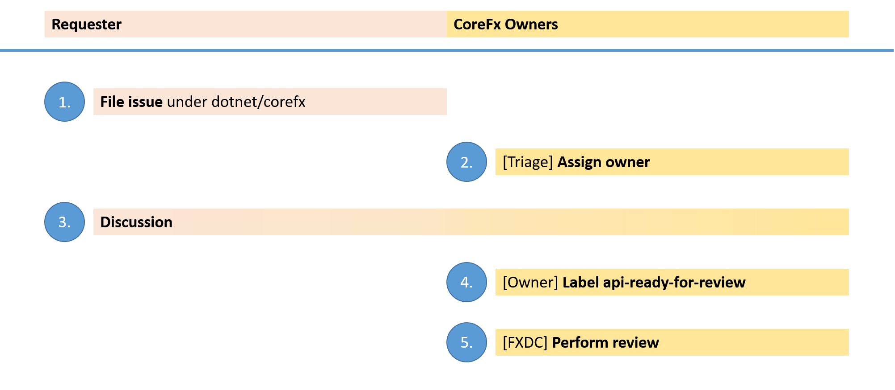

# API Review Process

The .NET Framework has a long standing history of taking API usability extremely seriously. Thus, we generally review every single API that is added to the product. This page discusses how we conduct design reviews for components that are open sourced.

## Which APIs should be reviewed?

The rule of thumb is that we (**corefx**) review every API that is being added to the `System.*` namespaces. In some cases, we also review APIs that are added to other namespaces, such as `Microsoft.*`. We mostly do this for high impact APIs, such as Roslyn, and when both the owner of the technology and we feel there is win-win for both sides if we review the APIs. However, we can't scale to review all APIs being added to .NET.

## Process

## Steps

1. **Requester files an issue**. The issue description should contain a speclet that represents a sketch of the new APIs, including samples on how the APIs are being used. The goal isn't to get a complete API list, but a good handle on how the new APIs would roughly look like and in what scenarios they are being used. Here is [a good example](https://github.com/dotnet/corefx/issues/271).

2. **We assign an owner**. We'll assign a dedicated owner from our side that
sponsors the issue. This is usually the area owner for which the API proposal or design change request was filed for.

3. **Discussion**. The goal of the discussion is to help the assignee to make a
decision whether we want to pursue the proposal or not. In this phase, the goal
isn't necessarily to perform an in-depth review; rather, we want to make sure
that the proposal is actionable, i.e. has a concrete design, a sketch of the
APIs and some code samples that show how it should be used. If changes are necessary, the requester is encouraged to edit the issue description. This allows folks joining later to understand the most recent proposal. To avoid confusion, the requester should maintain a tiny change log, like a bolded "Updates:" followed by a bullet point list of the updates that were being made.

4. **Owner makes decision**. When the owner believes enough information is available to make a decision, she will update the issue accordingly:

    * **Mark for review**. If the owner believes the proposal is actionable, she will label the issue with `api-ready-for-review`.
    * **Close as not actionable**. In case the issue didn't get enough traction to be distilled into a concrete proposal, she will close the issue.
    * **Close as won't fix as proposed**. Sometimes, the issue that is raised is a good one but the owner thinks the concrete proposal is not the right way to tackle the problem. In most cases, the owner will try to steer the discussion in a direction that results in a design that we believe is appropriate. However, for some proposals the problem is at the heart of the design which can't easily be changed without starting a new proposal. In those cases, the owner will close the issue and explain the issue the design has.
    * **Close as won't fix**. Similarly, if proposal is taking the product in a direction we simply don't want to go, the issue might also get closed. In that case, the problem isn't the proposed design but in the issue itself.

5. **API gets reviewed**. The group conducting the review is called *FXDC*, which stands for *framework design core*. In the review, we'll take notes and provide feedback. After the review, we'll publish the notes in the [API Review repository](https://github.com/dotnet/apireviews). A good example is the [review of immutable collections](https://github.com/dotnet/apireviews/tree/master/2015-01-07-immutable). Multiple outcomes are possible:

    * **Approved**. In this case the label `api-ready-for-review` is replaced
    with `api-approved`.
    * **Needs work**. In case we believe the proposal isn't ready yet, we'll
    replace the label `api-ready-for-review` with `api-needs-work`.
    * **Rejected**. In case we believe the proposal isn't a direction we want to go after, we simply write a comment and close the issue.

## Pull requests

Pull requests against **corefx** shouldn't be submitted before getting approval. Also, we don't want to get work in progress (WIP). The reason being that we want to reduce the number pending PRs so that we can focus on the work the community expects we take action on.

If you want to collaborate with other people on the design, feel free to perform the work in a branch in your own fork. If you want to track your TODOs in the description of a PR, you can always submit a PR against your own fork. Also, feel free to advertise your PR by linking it from from the issue you filed against **corefx** in the first step above.

## API Design Guidelines

The .NET design guidelines are captured in the famous book [Framework Design Guidelines](http://amazon.com/dp/0321545613) by Krzysztof Cwalina and Brad Abrams.

A digest with the most important guidelines are available in our [documentation](../coding-guidelines/framework-design-guidelines-digest.md). Long term, we'd like to publish the individual guidelines in standalone repo on which we can also accept PRs and -- more importantly for API reviews -- link to.

## API Review Notes

The API review notes are being published in [API Review repository](https://github.com/dotnet/apireviews).
