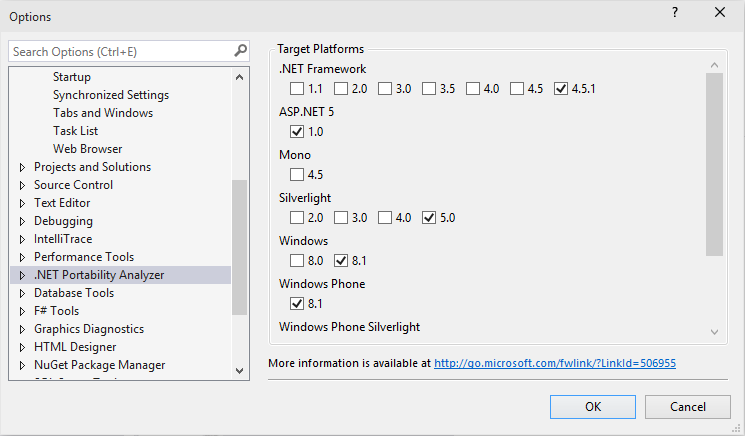
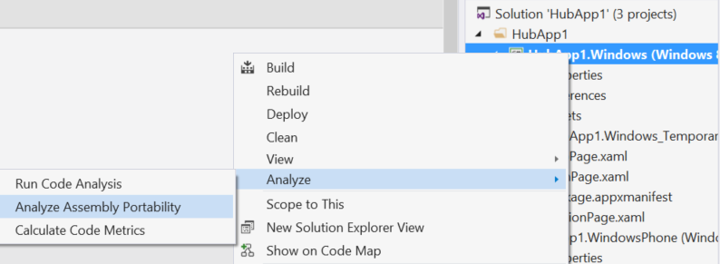
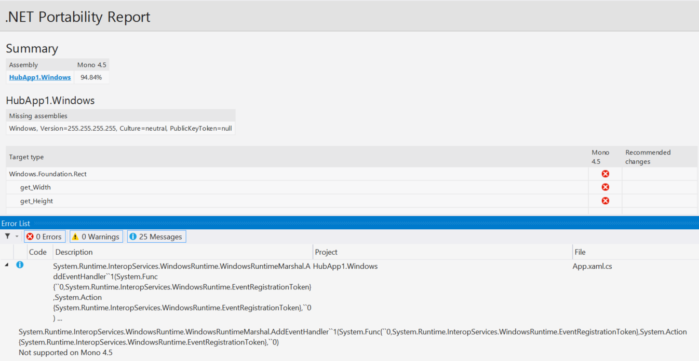

# Making your libraries compatible with .NET Core and other .NET Platforms

Want to make your libraries multi-platform? Want to see how much work is required to make your application compatible with other .NET platforms? The [**.NET Portability Analyzer**](http://github.com/microsoft/dotnet-apiport) is a tool that provides you with a detailed report ([example report](http://dotnet.github.io/port-to-core/Moq4_ApiPortabilityAnalysis.htm)) on how portable your code is across .NET platforms by analyzing assemblies. The Portability Analyzer is offered as a Visual Studio Extension and as a console app.

## New Targets

- [.NET Core 5](https://www.dotnetfoundation.org/netcore): Has a modular design, employs side-by-side, and targets cross-platform scenarios. Side-by-side allows you to adopt new .NET Core versions without breaking other apps.
- [ASP.NET 5](https://www.dotnetfoundation.org/aspnet-5): is a modern web-framework built on .NET Core 5 thus giving developers the same benefits.
- [.NET Native](http://blogs.msdn.com/b/dotnet/archive/2014/04/24/dotnetnative-performance.aspx): Improve performance of your Windows Store apps that run on x64 and ARM machines by using .NET Native's static compilation.

## How to Use Portability Analyzer

To begin using the .NET Portability Analyzer, download the extension from the Visual Studio Gallery. You can configure it in Visual Studio via  *Tools* >> *Options* >> *.NET Portability Analyzer* and select your Target Platforms. For now, please use ASP.NET 5 as a proxy for all .NET Core 5-based platforms (e.g. [Windows 10 .NET UAP apps](http://blogs.windows.com/buildingapps/2015/03/02/a-first-look-at-the-windows-10-universal-app-platform/)). 

To analyze your entire project, right-click on your project in the Solution Explorer and select *Analyze* >> *Analyze Assembly Portability*. Otherwise, go to the Analyze menu and select *Analyze Assembly Portability*. From there, select your project's executable or .dll.

After running the analysis, you will see your .NET Portability Report. Only types that are unsupported by a target platform will appear in the list and you can review recommendations in the **Messages** tab in the **Error List**. You can also jump to problem areas directly from the **Messages** tab.

Don't want to use Visual Studio? You can also use the Portability Analyzer from the Command Prompt. Download the command-line analyzer [here](http://github.com/microsoft/dotnet-apiport/releases).

- Type the following command to analyze the current directory: `ApiPort.exe analyze -f . `
- To analyze a specific list of .dlls type the following command: `ApiPort.exe analyze -f first.dll -f second.dll -f third.dll`

Your .NET Portability Report will be saved as an Excel .xlsx file in your current directory. The **Details** tab in the Excel Workbook will contain more info.

For more info on the .NET Portability Analyzer, read the [documentation](https://github.com/Microsoft/dotnet-apiport/blob/master/docs/HowTo/Introduction.md).
