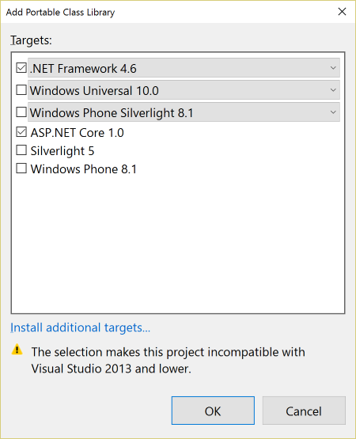

Using MSBuild to build .NET Core projects
=========================================

The .NET Core tooling is going to [move from project.json to MSBuild based projects](https://blogs.msdn.microsoft.com/dotnet/2016/05/23/changes-to-project-json/).
We expect the first version of the .NET Core tools that use MSBuild to ship along with Visual Studio "15".  However, it is possible to use MSBuild for .NET Core
projects today, and this page shows how.

We recommend that most people targeting .NET Core today use the default tooling experience with project.json.  This is because we haven't yet added support to MSBuild
for a lot of the benefits that project.json has, because a lot of the ASP.NET based tooling will not work with MSBuild today, and because when we do release .NET Core
tooling which uses MSBuild, it will be able to automatically convert from project.json to MSBuild based projects.

You may want to consider using MSBuild to target .NET Core for existing projects that already use MSBuild that you want to port to .NET Core, or if you are using
MSBuild's extensibility in your build for scenarios that are not well supported for project.json projects.

Prerequisites
=============

- [Visual Studio 2015 Update 3 RC](https://www.visualstudio.com/downloads/visual-studio-prerelease-downloads#sec1) or higher
- [.NET Core tools for Visual Studio](https://www.visualstudio.com/downloads/download-visual-studio-vs)
- NuGet Visual Studio extension [v3.5.0-beta](https://dist.nuget.org/visualstudio-2015-vsix/v3.5.0-beta/NuGet.Tools.vsix) or later

Creating a library targeting .NET Core
======================================

- File > New > Project

  

- Select ".NET Framework 4.6" and "ASP.NET Core 1.0"

  

- In the "Library" tab of the project properties, click on the "Target .NET Platform Standard" link, and click "Yes" in the dialog that is shown
- In the `project.json` file:
    - Change the version number of the `NETStandard.Library` package to `1.5.0-rc2-24027` (this is the .NET Core RC2 version of the package).
    - Add the below `imports` definition inside the `netstandard1.5` framework definition.  This will allow your project to reference .NET Core compatible
      NuGet packages that haven't been updated to target .NET Standard

        ```json
        "netstandard1.5": {
            "imports": [ "dnxcore50", "portable-net452" ]
        }
        ```

Creating a .NET Core console application
========================================
Building a console application for .NET Core requires some customization of the MSBuild build process.  A good option to start with is
[coretemplate](https://github.com/mellinoe/coretemplate).  This is a basic project which brings in MSBuild targets for .NET Core.  

It is also possible to start by creating a project in Visual Studio and modify it to target .NET Core.  The instructions below show the minimal steps to get this working.
In contrast to coretemplate, a project created this way:

- Won't include configurations for targeting Linux and Mac OS
- Will use the CoreRun instead of the CoreConsole host.  This means that you will need to run the app via `CoreRun MyApp.exe` instead of just `MyApp.exe`.
To use the CoreConsole host, you need to reference the `Microsoft.NETCore.ConsoleHost` package instead of `Microsoft.NETCore.TestHost`, and after building rename `MyApp.exe`
to `MyApp.dll` and rename `CoreConsole.exe` to `MyApp.exe`.  Coretemplate does this in a [common targets file](https://github.com/mellinoe/corebuild/blob/master/coreconsole.targets).
- Visual Studio may ask you to enable developer mode for Windows 10 when you open the project

Creating a .NET Core console application from Visual Studio
===========================================================

- Start by following the steps in the previous section to create a library targeting .NET Core
- Open the project's XML for editing (in Visual Studio, right click on the project -> Unload Project, right click again -> Edit MyProj.csproj)
    - Remove the `ProjectTypeGuids` property
    - Add the following property: `<BaseNuGetRuntimeIdentifier>win10</BaseNuGetRuntimeIdentifier>`
    - Add the following at the end of the file (after the import of `Microsoft.Portable.CSharp.Targets`:

        ```xml
        <PropertyGroup>
            <AutoUnifyAssemblyReferences>true</AutoUnifyAssemblyReferences>
            <StartAction>Program</StartAction>
            <StartProgram>$(TargetDir)CoreRun.exe</StartProgram>
            <StartArguments>$(TargetPath)</StartArguments>
            <DebugEngines>{2E36F1D4-B23C-435D-AB41-18E608940038}</DebugEngines>
        </PropertyGroup>
        ```

    - Close the .csproj file, and reload the project in Visual Studio
- In the project properties:
    - Change the Output type to "Console Application" in the Application tab
    - In the "Build" tab, select "All Configurations" and change the "Platform Target" to "x64"
- Add runtimes and dependencies on the runtime and host to `project.json`
    - Add a `runtimes` section with the following runtimes: `win10-x64`, `ubuntu.14.04-x64`, and `osx.10.10-x64`
    - Add a dependency on `Microsoft.NETCore.Runtime` version `1.0.2-rc2-24027` and `Microsoft.NETCore.TestHost` version `1.0.0-rc2-24027`
    - When you're done, the `project.json` should look like this:

        ```json
        {
            "dependencies": {
                "NETStandard.Library": "1.5.0-rc2-24027",
                "Microsoft.NETCore.TestHost": "1.0.0-rc2-24027",
                "Microsoft.NETCore.Runtime": "1.0.2-rc2-24027"
            },
            "runtimes": {
                "win10-x64": { },
                "ubuntu.14.04-x64": { },
                "osx.10.10-x64": { }
            },
            "frameworks": {
                "netstandard1.5": {
                    "imports": [ "dnxcore50", "portable-net452" ]
                }
            }
        }
        ```

- Add a 'Main' method, for example:

    ```C#
    public static void Main(string[] args)
    {
        Console.WriteLine("Hello, .NET Core!");
    }
    ```

- You should be able to run your program with F5 in Visual Studio, or from the command line in the output folder with `CoreRun MyApp.exe` 