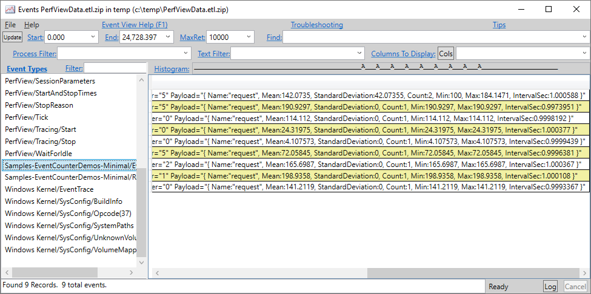
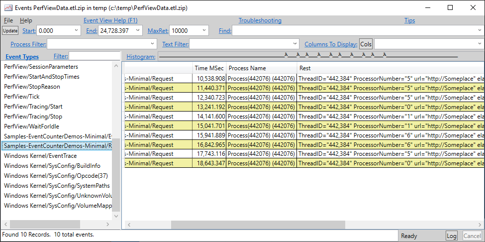
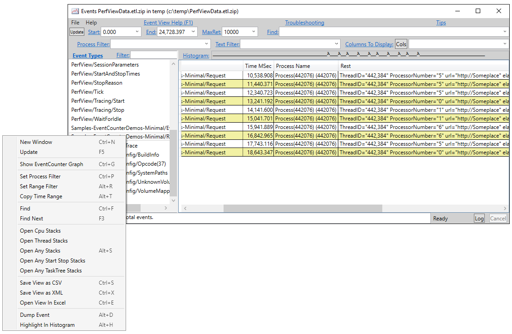
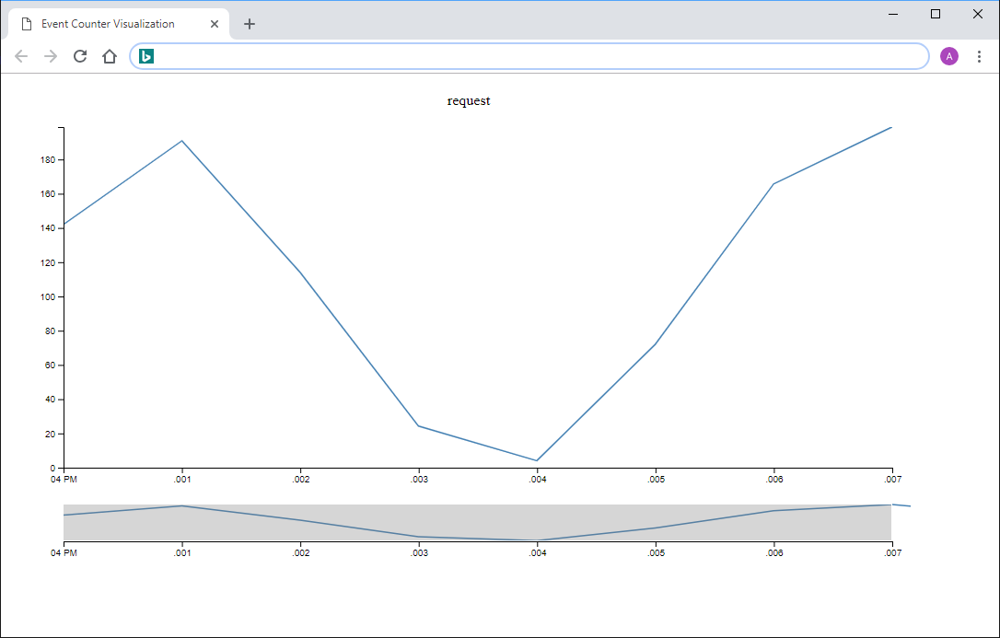

# Introduction Tutorial: How to measure performance for very frequent events using EventCounters

While `EventSource` is fast, logging too many events for very frequent events is still a performance hit. In this tutorial, we will introduce `EventCounter`, a mechanism for measuring performance for very frequent events.

For events that happen very frequently (for example, if it happens every few milliseconds), in general, you will want the performance overhead per event to be very low (e.g. less than a millisecond); otherwise, it is going to cost a significant performance overhead. Logging an event, at the end of the day, needs to write something to the disk. If the disk is not fast enough, you will lose events. We need a solution other than logging the event itself.

When dealing with large number of events, knowing the measure per event is not very useful either. Most of the time all we need is just some statistics out of it. So we could crank the statistics within the process itself and then write an event once in a while to report the statistics, that's what `EventCounter` will do for us. Let's take a look at an example how to do this in `Microsoft.Diagnostics.Tracing.EventSource`.

In the sequel, we assume you are familiar with the basic `EventSource` usage, if you don't, please refer to [Vance's excellent blog](http://blogs.msdn.com/b/vancem/archive/2012/07/09/logging-your-own-etw-events-in-c-system-diagnostics-tracing-eventsource.aspx) on that.

Without further ado, here is an example on how to use the `EventCounter`

```c#
// Give your event sources a descriptive name using the EventSourceAttribute, otherwise the name of the class is used. 
[EventSource(Name = "Samples-EventCounterDemos-Minimal")]
public sealed class MinimalEventCounterSource : EventSource
{
    // define the singleton instance of the event source
    public static MinimalEventCounterSource Log = new MinimalEventCounterSource();
    private EventCounter requestCounter;

    private MinimalEventCounterSource() : base(EventSourceSettings.EtwSelfDescribingEventFormat) 
    {
        this.requestCounter = new EventCounter("request", this);
    }

    /// <summary>
    /// Call this method to indicate that a request for a URL was made which took a particular amount of time
    public void Request(string url, float elapsedMSec)
    {
        // Notes:
        //   1. the event ID passed to WriteEvent (1) corresponds to the (implied) event ID
        //      assigned to this method. The event ID could have been explicitly declared
        //      using an EventAttribute for this method
        //   2. Each counter supports a single float value, so conceptually it maps to a single
        //      measurement in the code.
        //   3. You don't have to have log with WriteEvent if you don't think you will ever care about details
        //       of individual requests (that counter data is sufficient).  
        WriteEvent(1, url, elapsedMSec);    // This logs it to the event stream if events are on.    
        this.requestCounter.WriteMetric(elapsedMSec);        // This adds it to the PerfCounter called 'Request' if PerfCounters are on
    }
}
```

The `WriteEvent` line is the `EventSource` part and is not part of `EventCounter`, it was written to show that you can log a message together with the event counter.

So, with that, we logged the metric to the `EventCounter`, but unless we can actually get the statistics out of it, it is not useful. To get the statistics, we need to enable the `EventCounter` by setting off a timer how frequently we want the events, as well as a listener to capture the events, to do that, you can use PerfView. Again, we assumed familiarity with PerfView, if not, you can refer to Vance's blog on that.

There is an extra keyword that you will need to specify the turn on the EventCounters.

```
PerfView /onlyProviders=*Samples-EventCounterDemos-Minimal:EventCounterIntervalSec=1 collect
```

Note the part about `EventCounterIntervalSec`, that indicate the frequency of the sampling.

As usual, turn on PerfView, and then run the sample code - we get have something like this



Now let's drill into what the data captured means - when I copied from PerfView, it looks like this

```
ThreadID="17,800" ProcessorNumber="5" Payload="{ Name:"request", Mean:142.0735, StandardDeviation:42.07355, Count:2, Min:100, Max:184.1471, IntervalSec:1.000588 }" 
```

Now it is obvious that within a sampling period, we have 9 events, and all the other statistics.

Notice that this command also logs the events, so we will get both the events and the counter statistics.



As we mentioned, to avoid overhead, sometimes we will want just the counters. This command can be used to log *only* the counters:

```
PerfView /onlyProviders=*Samples-EventCounterDemos-Minimal:*:Critical:EventCounterIntervalSec=1 collect
```

Notice the `Critical` keyword in the command line, that is used to filter out the other events with lower priorities.

In the next relaese of PerfView (> 2.0.26), we can visualize the counters using PerfView. To do so, you can right click on the event like this and choose the show event counter graph item:



Then it will show you a line graph showing the mean of the data like this. If you have multiple event counters, it can show multiple plots. You can also filter out a particular subset of counters using the filter text option:

