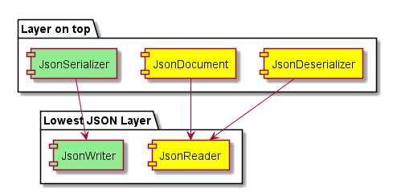
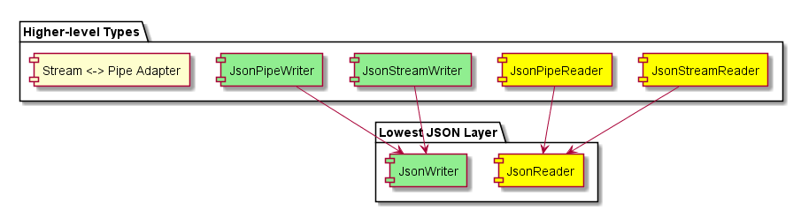

# System.Text.Json Roadmap

## Overview

* Our goal is to provide high-performance JSON APIs built into .NET Core.
  See the [announcement](https://github.com/dotnet/announcements/issues/90) for more details.
  - For the first version of the library, our objective is to remove the
    dependency on JSON.NET within the shared framework. 
  - The primary focus will be on core functionality with emphasis on performance
    over capabilities and additional features.
  - These APIs will be targeting .NET Core specifically as part of v1.
    Providing a netstandard implementation can be considered in the future.

## Design Requirements

* Optimize for performance and allocations over usability and convenience.
  - The mainline scenarios should remain easy and efficient, while all others
    should be pay-for-play
* Focus primarily on providing UTF-8 support.
* Provide capabilities to support data from both streams and pipelines.
  - Some work/boilerplate code required by the caller is acceptable
* No unnecessary levels of abstraction that would make writing higher level
  concepts on top of the Reader/Writer APIs untenable.

## Components

### JsonReader/JsonWriter

* JsonReader provides a high-performance API for forward-only, read-only access
  to the UTF-8 encoded JSON text. It processes the text sequentially with no
  caching. It is a foundational component at the bottom of the stack and
  higher-level types that support additional functionality. It is primarily
  targeted at advanced developers.
  - Strict validation based on the [JSON RFC](https://tools.ietf.org/html/rfc8259) by default
  - Ability to set max depth
  - Ability to support skipping comments and provides extensible mechanism to
    opt-in to lenient behaviour if performance isn't regressed
  - Rejects invalid JSON and provides basic error info like line number
  - Support for reentrancy to read incomplete data, and continue reading once
    more data is presented
  - Does not directly support async
* JsonWriter provides a high-performance API for forward-only writing UTF-8
  encoded JSON text to an `IBufferWriter<T>`.
  - Supports writing unformatted (compact) JSON as well as formatted/indented JSON
  - Does not allow writing invalid JSON according to the [JSON RFC](https://tools.ietf.org/html/rfc8259)
  - Does not directly support async
  - Can accept a `JsonDocument` and write it to the output interface

### JsonDocument

* Provides the ability to parse and represent a JSON document in-memory from
  UTF-8 encoded JSON text. This will enable the caller to query the JSON 
  Document Object Model (DOM), i.e. random access of various nodes.
  - Ability to modify the DOM once it has been generated would be limited
    to slicing (i.e. only removing nodes would be supported)
  - Builds on top of the JsonReader
  - Ability to detach and retain a subset of the doc for stashing/later use
  - More details to follow

### JsonSerializer/Deserializer

* Builds on top of the JsonReader and JsonWriter.
* Optimized for performance over feature richness for v1.
* The deserializer will be based on `Reflection.Emit`.
* More details to follow - @glennc, @terrajobst, @steveharter

## Higher-level types

### JsonStreamReader/JsonStreamWriter & JsonPipeReader/JsonPipeWriter

* The underlying `JsonReader` supports reading data within `ReadOnlySpan<byte>`
  and therefore it would likely be a ref struct. This makes reading from a
  `Stream`, especially within an async context, difficult to achieve. Due to this,
  the caller would have to fetch data from the stream themselves and pass it
  to the low-level API. To make it easier for users, a higher-level type should
  be provided that accepts a stream and provides async capabilities without
  forcing the user to write the boilerplate code that deals with the ref struct
  workhorse.
* The underlying `JsonReader` supports reading data within
  `ReadOnlySequence<byte>` as well so it is feasible for the user to read data
  coming from a `Pipe` (from within an async context) as a sequence of segments
  and pass that along. Like streams, providing a higher-level type can help with
  making the end-to-end usage easier for the user when dealing with pipes.
* A [stream <-> pipe adapter](https://github.com/dotnet/corefx/issues/27246) will help with the interoperability of these types
  in general.

## Out of Current Scope & Future Considerations

* Support for netstandard for .NET Framework and other platforms
* Utf8String support
* AOT support
* JSON schema support
  - Specification for providing metadata to annotate and provide structural
    validation of JSON documents ([currently draft-07](http://json-schema.org/))

## API Discussions & Issues

* [JsonReader API Review](https://github.com/dotnet/apireviews/tree/master/2018/System.Text.Json)
* Placeholder for future API proposal issues
